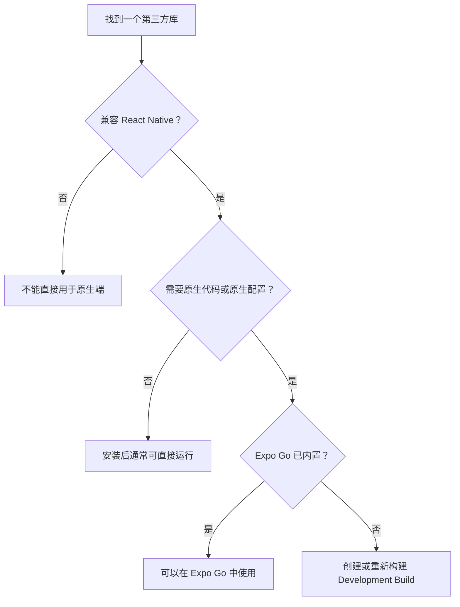

# 在 Expo 项目中使用 React Native、Expo SDK 和第三方库

> 原文：[Using Expo SDK, React Native, and third-party libraries](https://docs.expo.dev/workflow/using-libraries/)
> 文档更新时间：2026 年 6 月 3 日

## 文档解决的问题

这篇文档主要回答：

- Expo 项目可以使用哪些类型的库？
- 如何判断 npm 包是否兼容 React Native？
- 为什么有些库可以在 Expo Go 中运行，有些必须重新构建 App？
- 为什么推荐使用 `npx expo install`？
- 第三方库需要修改 Android/iOS 原生工程时应该怎么办？

它适合正在为 Expo/React Native 项目选择和安装依赖的开发者，特别是从 React Web 转向 React Native 的开发者。

---

## 一、React Native 项目中的三类库

可以先建立一个总体模型：

| 类型                | 来源           | 典型用途                             | 示例                         |
| ------------------- | -------------- | ------------------------------------ | ---------------------------- |
| React Native 核心库 | `react-native` | 基础 UI、交互和平台 API              | `View`、`Text`、`ScrollView` |
| Expo SDK 库         | `expo-*`       | 摄像头、音频、联系人、更新等设备能力 | `expo-camera`、`expo-device` |
| 第三方库            | npm、GitHub    | 导航、状态管理、业务 SDK 等          | React Navigation             |

React Web 中经常直接使用浏览器提供的 DOM、CSS 和 Web API；React Native 没有浏览器 DOM，它通过 React Native 组件和原生模块访问 Android/iOS 能力。

---

## 二、React Native 核心库

React Native 内置了开发移动端应用所需的基础组件和 API，例如：

- `<View>`：类似 Web 中用于布局的 `<div>`，但不完全等价。
- `<Text>`：用于显示文字。
- `<TextInput>`：文本输入。
- `<ScrollView>`：可滚动容器。
- `<ActivityIndicator>`：加载指示器。

这些组件直接从 `react-native` 导入：

```tsx
import { Text, View } from "react-native";

export default function App() {
	return (
		<View
			style={{
				flex: 1,
				justifyContent: "center",
				alignItems: "center",
			}}
		>
			<Text>Hello, world!</Text>
		</View>
	);
}
```

这里没有额外安装 `View` 或 `Text`，因为它们由当前项目使用的 React Native 版本提供。

### 版本关系

每个 Expo SDK 版本对应特定的 React Native 版本。因此，阅读 React Native API 文档时，需要确认当前 Expo SDK 对应哪个 React Native 版本。

这与普通 Web 项目有一个重要区别：React Native 原生库通常对 React Native 版本更加敏感，不能假设新版 npm 包一定兼容旧项目。([docs.expo.dev](https://docs.expo.dev/versions/latest))

---

## 三、Expo SDK 库

React Native 核心库主要提供基础能力，Expo SDK 在此基础上提供更多设备和系统功能，例如：

- 音频和视频
- 摄像头和条形码扫描
- 日历和联系人
- 地图
- OAuth 认证
- OTA 更新
- 设备信息

安装 Expo SDK 库时，推荐使用：

```bash
npx expo install expo-device
```

`npx expo install` 会：

1. 根据当前 Expo SDK 和 React Native 版本选择兼容版本。
2. 调用项目实际使用的 npm、Yarn、pnpm 或 Bun 完成安装。
3. 对已知版本不兼容问题给出警告。

它可以理解为 Expo 项目中更了解 React Native 版本关系的 `npm install`。([docs.expo.dev](https://docs.expo.dev/workflow/using-libraries/))

### 阅读 Expo SDK API 文档时要检查什么

一个典型的 Expo SDK API 页面通常包含：

- 平台兼容性，例如 Android、iOS、Web、Expo Go。
- 安装命令。
- 是否需要配置 config plugin。
- 基本代码示例。
- 导入方式。
- Hooks、组件属性、类型、方法和类。

使用 TypeScript 时，这些 API 信息通常也能通过 VS Code 自动补全查看。

### 已有 React Native 项目的特殊情况

如果项目是通过 React Native Community CLI 创建，并且还没有安装 `expo` 包，需要先按照 Expo Modules 安装指南把 Expo 模块系统接入项目。

“Expo SDK 库可以用于 React Native 项目”不代表完全不需要配置；前提是项目已经正确安装并配置 `expo` 包。

---

## 四、寻找第三方库

### 第一选择：React Native Directory

优先在 [React Native Directory](https://reactnative.directory/) 中搜索。

它专门收录 React Native 库，并提供维护状态、平台支持、Expo Go 兼容性等信息。

### 第二选择：npm

如果 React Native Directory 中没有，再搜索 npm。

但 npm 包不一定支持 React Native，因为 npm 同时包含适用于以下环境的包：

- 浏览器
- Node.js
- Electron
- React Native
- 其他 JavaScript 运行环境

例如，一个库即使是纯 JavaScript，如果内部使用了 `window`、`document`、Node.js 文件系统或其他 React Native 不具备的 API，也可能无法运行。

> “检查包使用了哪些运行环境 API”属于基于文档内容推导。原文明确说明 npm 包可能面向不同 JavaScript 环境，但没有逐一列举不兼容 API。

---

## 五、Expo Go 与 Development Build

这是整篇文档最重要的兼容性判断。

### Expo Go

Expo Go 是预先构建好的通用 App，内部只包含一组预先选定的原生模块。

因此：

- 不需要额外原生代码的库通常可以直接使用。
- Expo Go 已经内置的原生库可以使用。
- 需要添加新原生代码的库不能动态安装进 Expo Go。
- Expo Go 更适合学习、实验和快速原型，不适合作为生产级项目的完整开发环境。

可以在 React Native Directory 中检查库是否带有 `Expo Go` 标签。

### Development Build

Development build 是你自己项目的原生调试版本，通常包含 `expo-dev-client`。

它会把项目实际需要的 Android/iOS 原生依赖编译进 App，因此可以使用需要自定义原生代码或原生配置的 React Native 库。

文档明确说明：只要一个库兼容 React Native，就可以在包含所需原生代码的 Expo development build 中使用，但不一定能在 Expo Go 中使用。([docs.expo.dev](https://docs.expo.dev/workflow/using-libraries/))

### 一个关键区别

```text
npx expo start
```

只启动 Metro 开发服务器并提供 JavaScript 更新，不会把新的原生模块编译进已经安装的 App。

因此，安装需要原生代码的库之后，仅重启 `npx expo start` 通常不够，还需要生成并重新构建原生 App。

---

## 六、如何判断库是否需要 Development Build

文档提供了四个检查问题：

1. npm 包中是否包含 `android` 或 `ios` 目录？
2. README 是否提到 linking？
3. README 是否要求修改以下原生文件？
    - `android/app/src/main/AndroidManifest.xml`
    - `ios/Podfile`
    - `ios/Info.plist`
4. 这个库是否提供 config plugin？

只要任意一个问题的答案是“是”，就应该使用 development build。



### linking 是什么

React Native 库可能同时包含 JavaScript 和 Android/iOS 原生代码。linking 指的是让原生工程识别并连接这些原生模块。

现代 React Native 通常支持自动链接，但库仍可能要求额外修改权限、Podfile、Manifest 或 Info.plist。

---

## 七、安装第三方库的标准流程

### 1. 安装依赖

```bash
npx expo install @react-navigation/native
```

Expo 官方推荐优先使用 `npx expo install`，而不是直接使用：

```bash
npm install
yarn add
```

这是因为 Expo CLI 会尽可能选择兼容版本，并提示已知的不兼容问题。

### 2. 阅读库的 README

安装成功不代表配置完成。还需要检查库文档中是否要求：

- 安装其他依赖。
- 添加权限。
- 修改 App 配置。
- 添加 config plugin。
- 重新构建原生 App。

可以运行：

```bash
npx npm-home @react-navigation/native
```

打开包的主页；查看 GitHub 仓库可以使用：

```bash
npx npm-home --github react-native-localize
```

### 3. 处理原生配置

如果库需要原生配置，优先使用它提供的 config plugin。

config plugin 是在 Prebuild 阶段自动修改 Android/iOS 原生工程的 JavaScript 配置插件，例如修改：

- `AndroidManifest.xml`
- `Info.plist`
- `Podfile`
- 权限配置

如果库没有官方 config plugin，可以检查 Expo 社区维护的 [out-of-tree config plugins](https://github.com/expo/config-plugins)。

### 4. 重新生成和构建原生 App

**基于文档内容推导：**安装纯 JavaScript 库通常不需要重新构建；安装包含新原生代码或修改原生配置的库，需要重新生成并构建 development build。

原文档没有给出具体的本地构建命令，只链接到 development build 指南。结合 Expo 的开发流程，本地构建通常使用：

```bash
npx expo run:android
npx expo run:ios
```

---

## 八、不使用 Expo Prebuild 的项目

如果现有 React Native 项目不支持 Expo Prebuild，就不能使用 config plugin 自动修改原生工程。

此时有两个选择：

1. 接入 Expo Prebuild/CNG。
2. 按库 README 手动修改 Android 和 iOS 原生工程。

这意味着 config plugin 并不是运行时插件，而是依赖 Prebuild 流程的原生工程生成工具。([docs.expo.dev](https://docs.expo.dev/config-plugins/introduction))

---

## 九、排除依赖版本检查

如果有意使用不同于 Expo 推荐版本的依赖，可以在 `package.json` 中配置：

```json
{
	"expo": {
		"install": {
			"exclude": ["expo-updates", "expo-splash-screen"]
		}
	}
}
```

这些包将从以下命令的版本检查中排除：

```bash
npx expo start
npx expo-doctor
npx expo install
```

这项配置只是关闭版本警告，不会证明该版本兼容，也不会修复潜在问题。([docs.expo.dev](https://docs.expo.dev/versions/latest/config/package-json))

---

## 十、React Web 开发者最容易误解的地方

### “npm 能安装”不等于“React Native 能运行”

npm 只负责分发包，不保证包兼容 React Native 运行环境。

### “JavaScript 热更新正常”不等于“原生依赖已经生效”

Metro 可以快速更新 JavaScript，但不能向已经编译好的 App 动态加入 Kotlin、Java、Swift 或 Objective-C 代码。

### Expo Go 不是项目自己的原生 App

它是 Expo 预先构建的通用容器。development build 才包含项目自己的原生依赖和配置。

### `npx expo install` 不只是命令别名

它会根据 Expo SDK 和 React Native 的版本关系选择或检查依赖版本。

### config plugin 不是 Web 中的运行时插件

它在 Prebuild 阶段修改原生工程，最终结果会进入编译后的 Android/iOS App。

---

## 十一、推荐的实际开发流程

```text
确定功能需求
→ 优先检查 React Native / Expo SDK 是否已有能力
→ 在 React Native Directory 搜索第三方库
→ 检查 React Native、Android、iOS 和 Expo Go 兼容性
→ 使用 npx expo install 安装
→ 阅读 README 和额外配置要求
→ 判断是否涉及原生代码或原生配置
→ 必要时添加 config plugin
→ 必要时重新构建 development build
→ 在 Android 和 iOS 上分别验证
```

**基于经验建议：**选择库时还应检查最近更新时间、issue 状态、是否支持当前 React Native New Architecture，以及 Android/iOS 两个平台是否都有人持续维护。这些内容不是当前文档的重点，但会直接影响生产项目风险。

---

## 总结

这篇文档的核心不是“怎样执行安装命令”，而是建立一套库兼容性判断模型：

> React Native 项目既有 JavaScript 层，也有 Android/iOS 原生层。安装依赖前必须判断它是否只增加 JavaScript，还是会改变原生 App。

最实用的判断原则是：

- React Native 基础组件从 `react-native` 导入。
- 设备能力优先查看 Expo SDK。
- 第三方 React Native 库优先从 React Native Directory 寻找。
- 安装依赖优先使用 `npx expo install`。
- 涉及原生代码或原生配置时，使用 development build，并在变更后重新构建 App。
- Expo Go 兼容性和 Expo 项目兼容性不是一回事。
